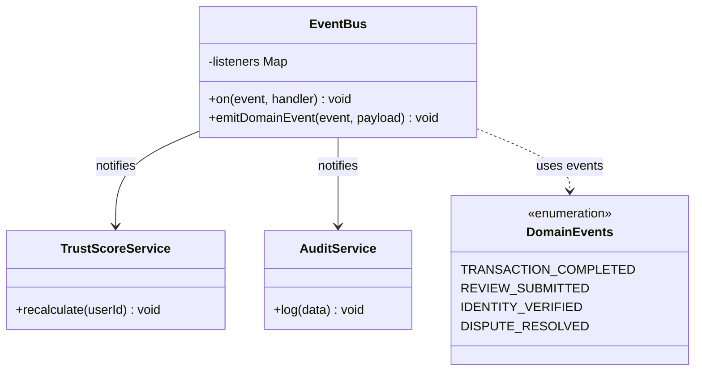

# TrustLayer — Class Diagram

> Reflects the actual TypeScript implementation in `backend/src/`.

---

## Full Class Diagram

```mermaid
classDiagram
    class AuthService {
        +register(data) User
        +login(email, password) Tokens
        +refreshToken(token) accessToken
        +logout(userId) void
    }

    class UserService {
        +getById(id) User
        +search(query) User[]
        +getAll() User[]
    }

    class IdentityService {
        +submit(userId, data) IdentityVerification
        +approve(userId, adminId) IdentityVerification
        +reject(userId, reason) IdentityVerification
        +getStatus(userId) IdentityVerification
    }

    class TransactionService {
        +create(data) Transaction
        +getByUser(userId) Transaction[]
        +getById(id) Transaction
        +complete(id) Transaction
        +fail(id) Transaction
    }

    class ReviewService {
        +create(data) Review
        +getBySubject(userId) Review[]
        +getByAuthor(userId) Review[]
    }

    class TrustScoreService {
        +getByUser(userId) TrustScore
        +recalculate(userId) TrustScore
    }

    class DisputeService {
        +create(data) Dispute
        +getByUser(userId) Dispute[]
        +getAll() Dispute[]
        +resolve(id, verdict, resolution) Dispute
    }

    class AuditService {
        +log(data) AuditLog
        +getByUser(userId) AuditLog[]
        +getAll() AuditLog[]
    }

    class EventBus {
        +emitDomainEvent(event, payload) void
        +on(event, handler) void
    }

    class AuthRepository {
        +findByEmail(email) User
        +create(data) User
        +saveRefreshToken(userId, token) void
        +findByRefreshToken(token) User
    }

    class TransactionRepository {
        +create(data) Transaction
        +findById(id) Transaction
        +findByUser(userId) Transaction[]
        +updateStatus(id, status) Transaction
    }

    class ReviewRepository {
        +create(data) Review
        +findBySubject(userId) Review[]
        +findByAuthor(userId) Review[]
    }

    class TrustScoreRepository {
        +findByUser(userId) TrustScore
        +upsert(userId, data) TrustScore
    }

    class AuditRepository {
        +create(data) AuditLog
        +findByUser(userId) AuditLog[]
        +findAll() AuditLog[]
    }

    AuthService --> AuthRepository
    TransactionService --> TransactionRepository
    TransactionService --> UserService
    ReviewService --> ReviewRepository
    ReviewService --> EventBus
    TrustScoreService --> TrustScoreRepository
    DisputeService --> EventBus
    AuditService --> AuditRepository
    IdentityService --> EventBus
```



---

## Architecture Layers

```
┌─────────────────────────────────────────────────┐
│                 HTTP Request                     │
└───────────────────────┬─────────────────────────┘
                        │
┌───────────────────────▼─────────────────────────┐
│           Controllers  (routes/*.ts)             │
│  Validates input with Zod, calls services        │
└───────────────────────┬─────────────────────────┘
                        │
┌───────────────────────▼─────────────────────────┐
│           Services  (services/*.ts)              │
│  Business logic, domain events, orchestration    │
└───────────────────────┬─────────────────────────┘
                        │
┌───────────────────────▼─────────────────────────┐
│         Repositories  (repositories/*.ts)        │
│  Pure Prisma data access, no business logic      │
└───────────────────────┬─────────────────────────┘
                        │
┌───────────────────────▼─────────────────────────┐
│            Prisma ORM  + SQLite/PostgreSQL        │
└─────────────────────────────────────────────────┘
```

---

## Design Patterns

### Observer Pattern — EventBus



### Strategy Pattern — Trust Score Calculator

```
<<interface>> ScoreCalculator
    +calculate(userId): number

WeightedScoreCalculator implements ScoreCalculator
    - identityWeight: 20
    - transactionWeight: 30
    - reviewWeight: 20
    - penaltyWeight: -5 per dispute
```

---

## Key Middleware

| Middleware           | File                              | Purpose                                |
|----------------------|-----------------------------------|----------------------------------------|
| `authMiddleware`     | middleware/auth.middleware.ts     | Verifies JWT, attaches `req.user`      |
| `adminMiddleware`    | middleware/admin.middleware.ts    | Checks `req.user.role === 'admin'`     |
| `validate(schema)`  | middleware/validation.middleware.ts | Zod schema validation on request body |
| `errorHandler`       | middleware/error.middleware.ts    | Global error formatter                 |
