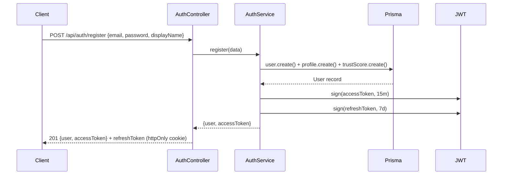
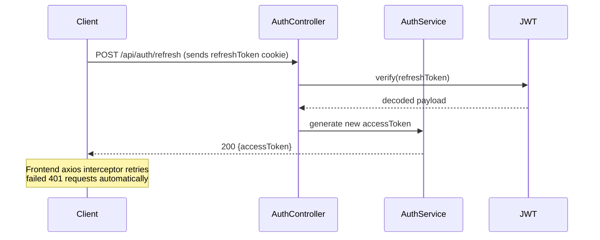
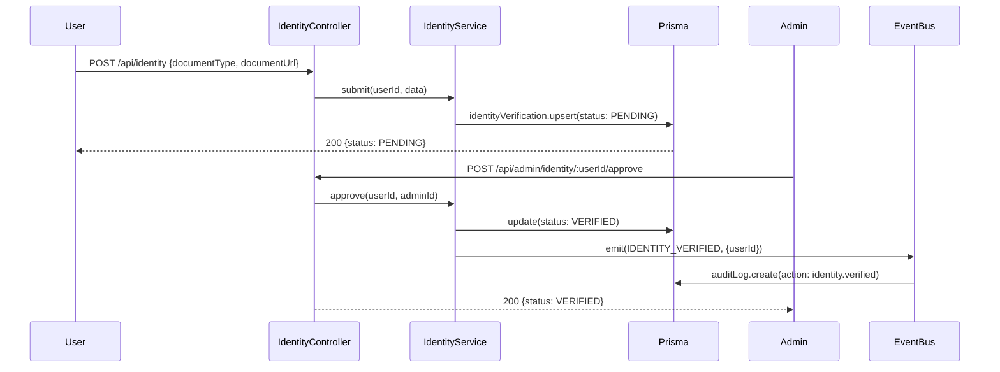
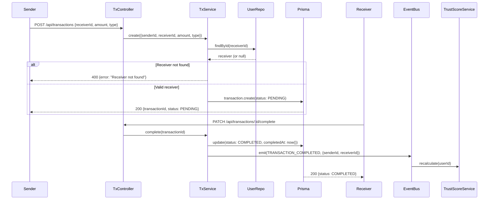
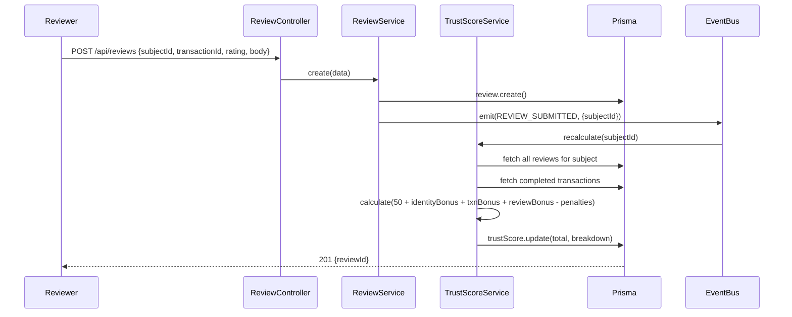
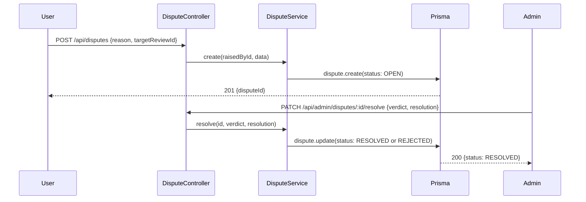

# TrustLayer — Sequence Diagrams

## 1. User Registration & Login



---

## 2. JWT Token Refresh



---

## 3. Identity Verification Flow



---

## 4. Transaction Creation & Completion



---

## 5. Review Submission & Trust Score Recalculation



---

## 6. Dispute Filing & Resolution



---

## Trust Score Formula

```
TrustScore = baseScore (50)
           + identityBonus   → up to +20  (verified identity)
           + transactionBonus → up to +30 (completed transactions × 2)
           + reviewBonus     → up to +20  (avg rating × 4)
           - penaltyPoints   → -5 per upheld dispute
```

| Score Range | Tier     |
|-------------|----------|
| 0 – 40      | Unrated  |
| 41 – 60     | Bronze   |
| 61 – 75     | Silver   |
| 76 – 90     | Gold     |
| 91 – 120    | Platinum |
