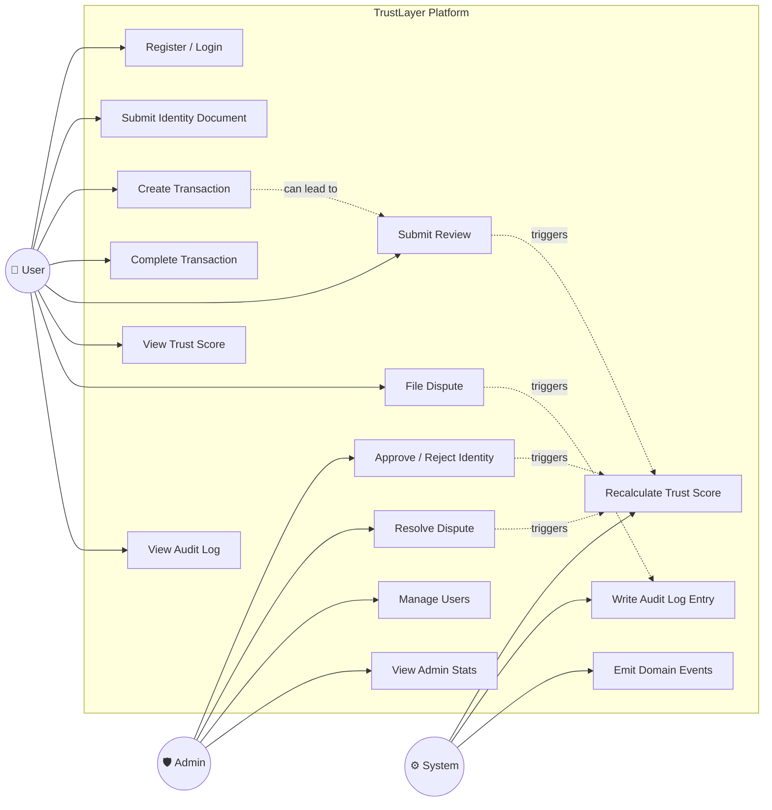

# TrustLayer — Use Case Diagram

## Actors

| Actor      | Description                                                   |
|------------|---------------------------------------------------------------|
| **User**   | Registers, verifies identity, creates transactions, reviews   |
| **Admin**  | Verifies identity documents, resolves disputes, manages users |
| **System** | Auto-recalculates trust scores, logs audit events             |

---

## Use Case Diagram

---

## Use Case Descriptions

| # | Use Case              | Actor  | REST Endpoint                        | Description                                        |
|---|-----------------------|--------|--------------------------------------|----------------------------------------------------|
| 1 | Register / Login      | User   | POST /api/auth/register, /login      | Create account, receive JWT tokens                 |
| 2 | Submit Identity       | User   | POST /api/identity                   | Upload ID document for admin review                |
| 3 | Create Transaction    | User   | POST /api/transactions               | Record a new transaction with another user         |
| 4 | Complete Transaction  | User   | PATCH /api/transactions/:id/complete | Mark a received transaction as complete            |
| 5 | Submit Review         | User   | POST /api/reviews                    | Rate (1–5) the counterparty after transaction      |
| 6 | View Trust Score      | User   | GET /api/trust/:id                   | See breakdown of own or another's score            |
| 7 | File Dispute          | User   | POST /api/disputes                   | Challenge an unfair review                         |
| 8 | View Audit Log        | User   | GET /api/audit/me                    | View immutable log of own account actions          |
| 9 | Approve/Reject ID     | Admin  | POST /api/admin/identity/:id/approve | Admin verifies or rejects uploaded ID document     |
| 10| Resolve Dispute       | Admin  | PATCH /api/admin/disputes/:id/resolve| Admin accepts or rejects a user's dispute          |
| 11| Manage Users          | Admin  | GET /api/admin/users                 | View all users and trust scores                    |
| 12| Admin Stats           | Admin  | GET /api/admin/stats                 | Platform-level statistics                          |
| 13| Recalculate Score     | System | Internal — EventBus                  | Auto-triggered on review/identity/dispute events   |
| 14| Write Audit Log       | System | Internal — AuditService              | Immutably log every sensitive action               |
| 15| Emit Domain Events    | System | Internal — EventBus                  | Decouple services via event-driven communication   |

---

## Relationships

| Relationship                       | Type     | Description                                       |
|------------------------------------|----------|---------------------------------------------------|
| Submit Review → Recalculate Score  | includes | Every review auto-triggers score recalculation    |
| Create Transaction → Submit Review | extends  | A completed transaction enables review submission |
| File Dispute → Write Audit Log     | includes | All disputes are logged immutably                 |
| Resolve Dispute → Recalculate Score| includes | Upheld disputes deduct penalty points             |
| Approve Identity → Recalculate Score | includes | Adding identity bonus recalculates score         |
